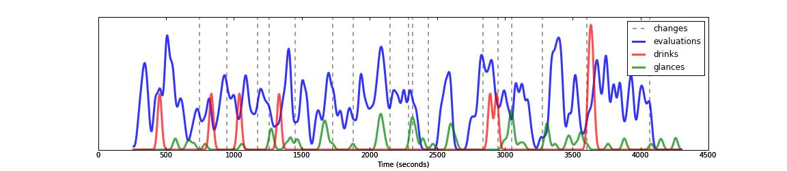

## Data from live coding environments

Making thought processes visible (?)

eg

From: https://www.youtube.com/watch?v=W0Cf2ywYUcI
(turn subtitles on)

- Drink (beer / mezcal)
- Glance at co-performer
- Code evaluation
- Thematic change

What else?

- Syntax errors
- Changing of mind
- Typing rate
- Gaze
- Crowd movement
- Machine listening

Use rate of evaluation as a pattern source ?

Look into Atom with Jack (?)..

## Data into live coding environments

- Is it possible to be able to work with history but also the future
  via e.g. Markov

## Deep learning

Seems to be ANNs with bugfixes and GPUs

Maybe Deep Learning will separate us from the structure of
computation, just as the Jacquard device separated us from the
structure of cloth?

## Datalove

Ref Quinn

Remix chains as datalove? Do a tidal remix chain then look for ways of
making datalove interfaces. Should they be anonymous? Should datalove
be exclusive or unbounded?
Could a remix chains be cyclic? It github a good interface for this?

## Patternlib

Revisit instructionset.org ideas, instructions for people to implement
as tidal patterns

## Keylogger

Emacs or atom plugin, or web based thingie (codemirror?) that saves out

* buffer position (x/y)
* timestamp in ms
* inserted character / diff?

every keypress/mouseclick/command

The 'change' event in codemirror seems perfect:
  https://codemirror.net/doc/manual.html#events
  https://github.com/yaxu/embedded/blob/master/edit/test.html

could get it out with osc over websockets
-- https://github.com/colinbdclark/osc.js/
-- https://github.com/jaspervdj/websockets/blob/master/example/server.lhs#L53

Having problems with browser osc..
https://github.com/colinbdclark/osc.js/issues/57

try just plain web sockets.. Estuary already does what I want.

Does atom have something similar?
- discussion here https://discuss.atom.io/t/change-listener/363

Live writing (sang won lee): http://web.eecs.umich.edu/~snaglee/live-writing/
Google docs replay: http://features.jsomers.net/how-i-reverse-engineered-google-docs/

## Gavin + James

Owning means of communication via APIs

## Pattern discovery/induction in algorithmic music

https://en.wikipedia.org/wiki/Pattern_recognition
https://en.wikipedia.org/wiki/Time_series#Methods_for_time_series_analyses
https://kb.osu.edu/dspace/bitstream/handle/1811/48550/EMR000097a-Dean_Bailes.pdf

Simon, H. A. and Sumner, R. K. (1992). Paern in music. In Schwanauer, S. and Levi, D.,
editors, Maine models of music, pages 83–110. MIT Press, Cambridge, MA, USA.
https://books.google.co.uk/books?id=CIFqbWcjfHEC&pg=PA1&lpg=PA1&dq=%22Machine+models+of+music+%22&source=bl&ots=Mo4zFDGdCR&sig=ZgsEkcdH_mxZA4nG3rrfDTvCfgQ&hl=en&sa=X&ved=0ahUKEwiFh9CSnebMAhULCMAKHXJ_BzIQ6AEIMDAD#v=onepage&q=pattern&f=false

Pattern induction and matching in music signals
http://www.cs.tut.fi/sgn/arg/klap/patterns.pdf

Finding meter and rhythm (ground and figure) in open data feeds?

Pattern Discovery Techniques for Music Audio
http://www.cs.cmu.edu/~./rbd/papers/patterndiscovery-JNMR-web.pdf

Large-Scale Pattern Discovery in Music (thesis)
http://academiccommons.columbia.edu/catalog/ac:156137

## Data ethnography

Programming as writing about data?

## Manifestos

From aymeric:
https://github.com/greyscalepress/manifestos/blob/master/output/output-archivo.pdf

antoine:
"Here is another one.. (1998) :
http://www.antoineschmitt.com/wp/wp-content/uploads/texte-2000-3eme-brouillonEN.pdf
(poorly translated from french, I admit)

And a Vademecum, for curators (2003) :
http://www.gratin.org/vademecum_en.html"
